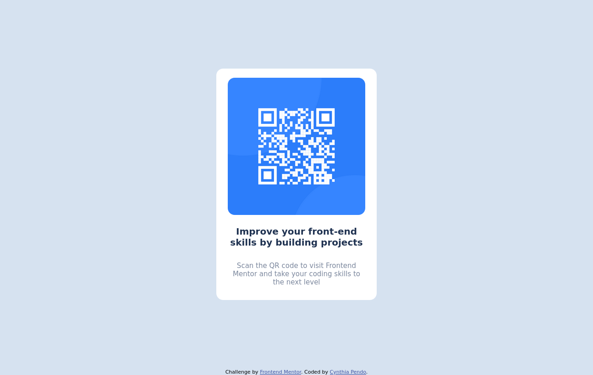

# Frontend Mentor - QR code component solution

This is a solution to the [QR code component challenge on Frontend Mentor](https://www.frontendmentor.io/challenges/qr-code-component-iux_sIO_H). 

## Table of contents

- [Overview](#overview)
- [Screenshot](#screenshot)
- [My process](#my-process)
- [Built with](#built-with)
- [Author](#author)

## Overview

The challenge is to build a QR code component and get it looking as close as possible
to the provided design templates.

### Screenshot

### Built with

- HTML
- CSS 

## Author

- Cynthia Pendo
